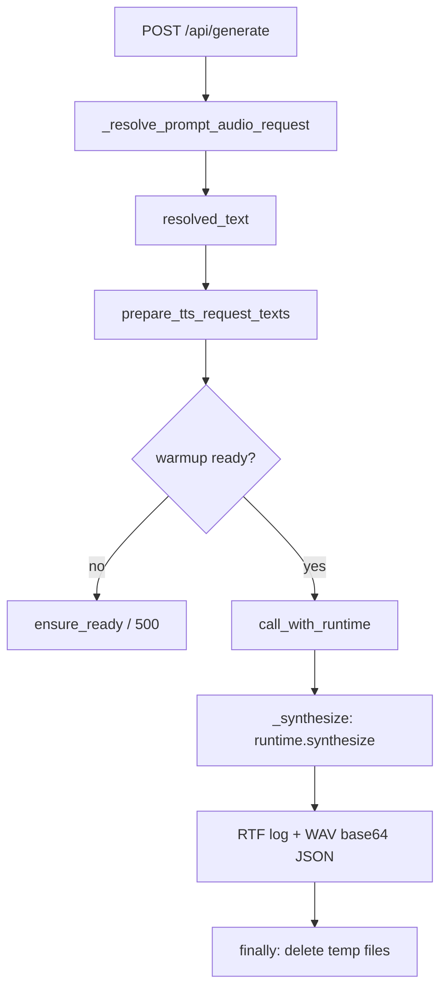
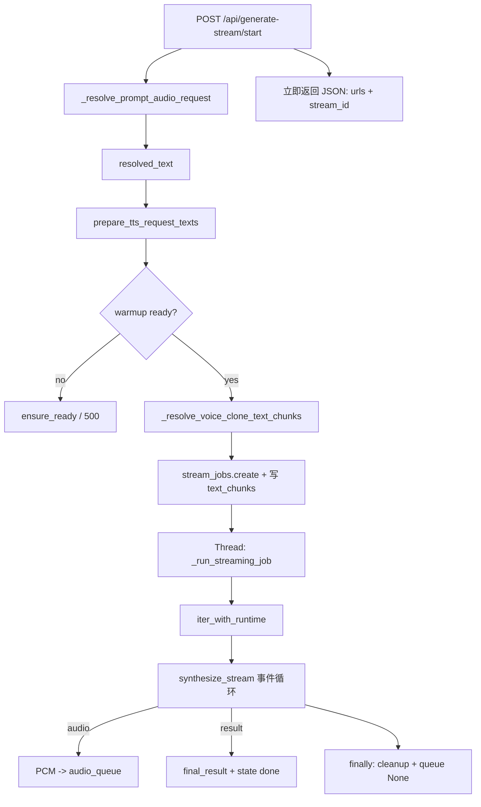
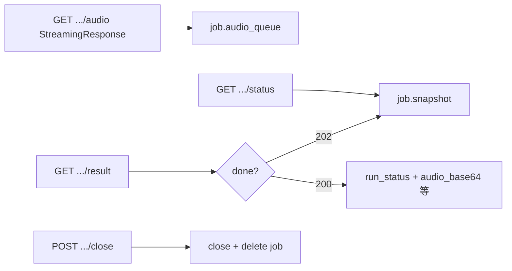

# `app.py` / `app_onnx.py` 代码理解

## 1. `app.py` 和 `app_onnx.py` 的关系

- `app.py` 是原始的 Web Demo 主体，默认面向 `NanoTTSService`（PyTorch runtime）。
- `app_onnx.py` 不是完全重写一套 Web 服务，而是复用 `app.py` 里的大量 Web 层逻辑：
  - `WarmupManager`
  - `_build_app(...)`
  - 页面渲染逻辑的大部分
  - `/generate`、`/api/generate-stream/...` 等接口框架（调用链见本文第 10、11 章）
- `app_onnx.py` 的核心思路是：
  - 用 `OnnxNanoTTSServiceAdapter` 把 ONNX 后端包装成一个“长得像 `NanoTTSService`”的对象；
  - 再把这个对象交给 `app.py` 的旧逻辑使用。

一句话：`app_onnx.py` 本质上是“ONNX 后端 + 兼容适配层 + 复用 legacy app”。

## 2. 两边 `runtime = ...` 分别在干嘛

### `app.py`

```python
runtime = NanoTTSService(
    checkpoint_path=args.checkpoint_path,
    audio_tokenizer_path=args.audio_tokenizer_path,
    device=resolved_runtime_device,
    dtype=args.dtype,
    attn_implementation=args.attn_implementation,
    output_dir=args.output_dir,
)
```

作用：

- 创建 PyTorch 版推理运行时 `NanoTTSService`
- 绑定模型路径、audio tokenizer、device、dtype、attention 配置、输出目录
- 后续交给：
  - `WarmupManager(runtime, ...)`
  - `_build_app(runtime, ...)`

### `app_onnx.py`

```python
runtime = OnnxNanoTTSServiceAdapter(
    model_dir=args.model_dir,
    output_dir=output_dir,
    cpu_threads=args.cpu_threads,
    max_new_frames=args.max_new_frames,
    text_normalizer_manager=text_normalizer_manager,
)
```

作用：

- 创建 ONNX 版运行时适配器 `OnnxNanoTTSServiceAdapter`
- 其内部再真正持有 `OnnxTtsRuntime`
- 对外暴露与 `NanoTTSService` 尽量一致的接口/属性，供 `app.py` 的 Web 层复用

## 3. `app_onnx.py` 的启动流程

`main()` 里与启动相关的关键步骤如下：

1. 解析参数、初始化 logging
2. 创建并启动 `WeTextProcessingManager`
3. 创建 `OnnxNanoTTSServiceAdapter`
4. 创建并启动 `legacy_app.WarmupManager`
5. 替换 legacy app 中的部分组件：
   - `legacy_app.RequestRuntimeManager = OnnxRequestRuntimeManager`
   - `legacy_app._render_index_html = _render_index_html_onnx`
6. 调用 `legacy_app._build_app(...)` 构造 FastAPI app
7. 调用 `uvicorn.run(...)` 真正启动 Web 服务

注意：

- `text_normalizer_manager.start()` 和 `warmup_manager.start()` 只是启动后台线程，不等于服务已经开始监听端口。
- 真正启动服务的是最后的 `uvicorn.run(...)`。

## 4. `WarmupManager` 里的 `"Warmup complete..."` 不是日志

`app.py` 中：

```python
message=(
    f"Warmup complete. device={self.runtime.device} "
    f"elapsed={result['elapsed_seconds']:.2f}s"
    + (" | WeTextProcessing ready." if self.text_normalizer_manager is not None else "")
)
```

这里写入的是 `WarmupManager` 内部状态里的 `message`，不是 `logging.info(...)`。

因此：

- 启动服务后终端里通常看不到这句；
- 这句话主要通过以下方式被使用：
  - 页面上的 warmup status
  - `/api/warmup-status`
  - 某些接口返回里的 `warmup_status_text` 

## 5. WeTextProcessing 是干嘛的

WeText 在这个项目里承担的是 **文本规范化（Text Normalization）** 的角色：

- 在 TTS 推理前，把更像书面输入的文本转换成更适合朗读的形式；
- 中英文分别走不同的 normalizer；
- 对中文还额外做了连字符 `-` 的预处理，避免一些误读。

它在 `prepare_tts_request_texts(...)` 这条文本预处理流水线中工作。

### WeText 不是模型推理核心，但会影响输入文本

- 它改的是输入文本，不是模型本身。
- 主要改善数字、符号、日期、缩写等朗读效果，以及整体稳定性。

## 6. WeText 是否一定需要

分两层理解：

### 功能上：不是绝对必须

- 是否启用 WeText 由 `enable_wetext` 控制。
- 关闭后，文本仍然可以走 `normalize_tts_text` 这一层，或者直接不做 WeText 规范化。
- `infer.py` / `infer_onnx.py` 也提供了开启/关闭 WeText 的参数。

### 以当前 `app_onnx.py` 的实现来说：部署时基本要能正常加载

原因：

- `main()` 里总会创建 `text_normalizer_manager`
- `WarmupManager` 在 warmup 里会对它执行 `ensure_ready()`
- 如果 WeText 加载失败，warmup 会进入 failed

也就是说：

- 从“是否一定要做文本规范化”这个角度，它不是强制；
- 但从“当前这份 ONNX Web 服务代码能否顺利 warmup 完成”这个角度，它基本是一个强依赖。

## 7. `app.py` 期望的 `runtime` 接口

`app.py` 主要依赖 `runtime` 提供这些能力：

### 方法

- `get_model()`
- `warmup()`
- `split_voice_clone_text(...)`
- `synthesize(...)`
- `synthesize_stream(...)`

### 属性

- `device`
- `dtype`
- `attn_implementation`
- `_checkpoint_global_attn_implementation`
- `_checkpoint_local_attn_implementation`
- `_configured_global_attn_implementation`
- `_configured_local_attn_implementation`
- `checkpoint_path`
- `audio_tokenizer_path`
- `output_dir`

PyTorch 路径下这些都由 `NanoTTSService` 原生提供；  
ONNX 路径下这些由 `OnnxNanoTTSServiceAdapter` 补齐或伪造。

## 8. `NanoTTSService` 和 `OnnxNanoTTSServiceAdapter` 如何对齐

### `get_model()`

- `NanoTTSService.get_model()`：真正加载并返回模型
- `OnnxNanoTTSServiceAdapter.get_model()`：直接返回 `self`

说明：

- `WarmupManager` 只需要“调用后 runtime 已准备好”这一语义，不要求必须拿到 PyTorch model 对象

### `warmup()`

- 两边都通过各自的 `synthesize(...)` 生成一段预热音频
- 返回值都包含 warmup 所需的结果信息（如 `audio_path`、`elapsed_seconds`）

### `split_voice_clone_text(...)`

- `NanoTTSService`：借助模型 tokenizer / sentence split 逻辑切分
- `OnnxNanoTTSServiceAdapter`：直接转发给内部 `OnnxTtsRuntime.split_voice_clone_text(...)`

### `synthesize(...)`

- 两边都支持同步合成，方法名和主要参数保持一致
- ONNX 侧会忽略一部分只属于 PyTorch 的参数，并把参数翻译成 `OnnxTtsRuntime.synthesize(...)` 的形式

### `synthesize_stream(...)`

- 两边都返回迭代器
- PyTorch 版本是原生流式实现
- ONNX 版本通过 worker 线程 + queue 产出兼容事件流

### `device`

- `NanoTTSService`：真实 `torch.device`
- `OnnxNanoTTSServiceAdapter`：`_CpuDeviceInfo()`

### `dtype`

- `NanoTTSService`：真实 dtype
- `OnnxNanoTTSServiceAdapter`：固定 `"float32"`

### `attn_implementation`

- `NanoTTSService`：真实 attention 配置
- `OnnxNanoTTSServiceAdapter`：固定 `"fixed"`

### `checkpoint_path` / `audio_tokenizer_path`

- `NanoTTSService`：来自 checkpoint / tokenizer 路径参数
- `OnnxNanoTTSServiceAdapter`：从 ONNX runtime 的元数据目录推导

### `_checkpoint_*` / `_configured_*`

- PyTorch 路径：反映真实 attention 配置
- ONNX 路径：用固定的 `"onnxruntime_cpu"` 填充，主要用于兼容 `/health` 展示

## 9. 为什么 ONNX 路径还要替换 `RequestRuntimeManager`

`app.py` 原本的 `RequestRuntimeManager` 假设 runtime 具备 PyTorch 侧的一些特征，例如：

- 可根据 `device.type` 区分 CPU / 非 CPU
- 在某些路径下会新建 CPU runtime
- 会用到 `voice_presets`

这些假设并不完全适合 ONNX 适配器，所以 `app_onnx.py` 用了自己的：

- `OnnxRequestRuntimeManager`

它的特点：

- 永远返回 `"cpu"`
- 按 `cpu_threads` 缓存/构造不同的 ONNX runtime
- 用自己的执行锁控制并发

也就是说，ONNX 路径不只是“补一个适配器对象”，还顺手把 runtime 管理器也换成了更适合 ONNX 的版本。

## 10. `/api/generate` 调用链（入口 → 最终合成）

以下均指 `app.py` 里 `_build_app(...)` 注册的 **`POST /api/generate`**（缓冲式整段生成）。PyTorch 与 ONNX **共用同一路由代码**，差异只在启动时注入的 `runtime` 与 `RequestRuntimeManager` 实现（原版 vs `OnnxRequestRuntimeManager`）。

### 10.1 总览（自上而下）

1. **FastAPI 路由** `generate(...)`  
   接收表单：`text`、`demo_id`、`prompt_audio`、`max_new_frames`、`enable_text_normalization`、`enable_normalize_tts_text`、`cpu_threads`、`attn_implementation`、采样与温度等。

2. **`_resolve_prompt_audio_request(...)`**  
   解析 demo 或上传的参考音频，得到磁盘上的 `prompt_audio_path`、展示用路径、以及上传临时文件清理路径。

3. **拼出 `resolved_text`**  
   用户文本为空时，可回落到选中 demo 的文案。

4. **`shared_prepare_tts_request_texts(...)`**（即 `text_normalization_pipeline.prepare_tts_request_texts`）  
   按开关做 `normalize_tts_text`、WeText 等，得到 `prepared_texts["text"]` / `normalized_text` / `normalization_method` 等。

5. **Warmup 门闸**  
   `warmup_manager.snapshot()`；若未 `ready` 则 `ensure_ready()`，失败则 `500` 返回，并清理上传临时文件。

6. **定义闭包 `_synthesize(selected_runtime)`**  
   内部调用 **`selected_runtime.synthesize(...)`**，其中：
   
   - `text` 使用 **`prepared_texts["text"]`**（已规范化）；
   - `mode="voice_clone"`，`voice=None`（由 runtime 按 prompt 解析音色/参考）；
   - `attn_implementation` 经 **`_resolve_attn_for_runtime(selected_runtime, ...)`**（CPU 上会映射部分选项到 `eager`）。

7. **`runtime_manager.call_with_runtime(...)`**  
   
   - `requested_execution_device="cpu"`（该路由写死为 `"cpu"`）；
   - `cpu_threads` 来自表单；
   - 在回调里执行 **`_synthesize`**。  
     **PyTorch**：`RequestRuntimeManager` 可能懒建 CPU runtime、并在 CPU 路径下调整 `torch.set_num_threads`；**ONNX**：`OnnxRequestRuntimeManager` 按 `cpu_threads` 选取/构造缓存的 `OnnxNanoTTSServiceAdapter`，再加执行锁。

8. **合成之后（仍在路由内）**  
   
   - 打 **`Nano-TTS generate RTF`** 日志；  
   - `text_chunks`：优先用 `result["voice_clone_text_chunks"]`，若为空则 **`_resolve_voice_clone_text_chunks`**（内部再一次 `call_with_runtime` + `split_voice_clone_text`，用于前端分句展示）；  
   - 将 `waveform_numpy` 转成 WAV 字节并 **Base64** 写入 JSON 响应；  
   - 附带 warmup / 文本规范化状态文案等。  
   - `finally`：删除生成 wav 与上传临时文件（响应里只留 base64）。

### 10.2 文本切分相对主合成的位置

- **主合成**：一次 `synthesize(...)`，模型侧可能已返回 `voice_clone_text_chunks`。  
- **兜底切分**：若结果里没有 chunks，才用 **`split_voice_clone_text`** 单独再跑一遍（同样走 `call_with_runtime`）。

### 10.3 Mermaid 简图（便于一眼扫）



### 10.4 ONNX 专有点（仍走同一路由时）

- **`selected_runtime.synthesize`** 实际是 **`OnnxNanoTTSServiceAdapter.synthesize`**，内部再调 **`OnnxTtsRuntime.synthesize`**，且适配器里对 ONNX 常 **`enable_wetext=False`**（规范化已在步骤 4 完成）。  
- **`call_with_runtime`** 的行为以 **`OnnxRequestRuntimeManager`** 为准（与 PyTorch 版 `RequestRuntimeManager` 不同）。

## 11. `generate-stream` 调用链（`start` + 后台线程 + 配套 URL）

以下均指 `app.py` 里 `_build_app(...)` 注册的 **`POST /api/generate-stream/start`**，以及同一模块内与之配套的 **`GET /api/generate-stream/{stream_id}/status`**、**`GET .../audio`**、**`GET .../result`**、**`POST .../close`**。PyTorch 与 ONNX **共用同一路由与 `StreamingJob` / `_run_streaming_job` 逻辑**；差异只在启动时注入的 **`runtime` + `RequestRuntimeManager`**（原版 vs `OnnxRequestRuntimeManager`），以及底层 **`synthesize_stream`** 的实现。

与 **`POST /api/generate`** 的对比要点：**整段 generate** 在同一次请求里 **`call_with_runtime` → `synthesize` → JSON 里塞 WAV Base64`**；**流式** 则是 **`start` 只建任务并起线程**，音频走 **`audio_queue` + `GET .../audio` 的 `StreamingResponse`**，最终摘要走 **`GET .../result`**（或失败时 `status` / `result` 反映错误）。

### 11.1 `start` 路由：与 generate 相同的前半段

1. **FastAPI 路由** `generate_stream_start(...)`  
   接收表单：`text`、`demo_id`、`prompt_audio`、`max_new_frames`、`voice_clone_max_text_tokens`、`tts_max_batch_size`、`codec_max_batch_size`、`enable_text_normalization`、`enable_normalize_tts_text`、`cpu_threads`、`attn_implementation`、采样与温度、`seed` 等（与 generate 侧字段对齐度高，便于同一前端切换）。

2. **`_resolve_prompt_audio_request(...)`**  
   与 generate 相同：解析 demo 或上传参考音频，得到磁盘上的 `prompt_audio_path`、展示路径、上传临时文件清理路径 `prompt_audio_cleanup_path`。

3. **`resolved_text`**  
   用户文本为空时回落到选中 demo 文案；若仍为空则 **`400`** 并清理上传临时文件。

4. **`shared_prepare_tts_request_texts(...)`**（`text_normalization_pipeline.prepare_tts_request_texts`）  
   与 generate 相同：按开关做 `normalize_tts_text`、WeText 等，得到 `prepared_texts["text"]` / `normalized_text` / `normalization_method` 等。

5. **Warmup 门闸**  
   与 generate 相同：`warmup_manager.snapshot()` → 未 `ready` 则 `ensure_ready()` → 仍失败则 **`500`** 并清理上传临时文件。

### 11.2 `start` 路由：相对 generate 多出来的步骤（起线程之前）

6. **`_resolve_voice_clone_text_chunks(...)`**  
   **`call_with_runtime(..., callback=lambda r: r.split_voice_clone_text(...))`**，在**尚未**调用 `synthesize_stream` 之前就把全文切成 `text_chunks`，写入即将创建的 **`StreamingJob.text_chunks`**（供前端分句与进度展示）。  
   **与 generate 的差异**：generate 是 **`synthesize` 完成后** 优先用返回里的 `voice_clone_text_chunks`，没有再切才兜底 `split_voice_clone_text`；stream 是 **先切好文案，再流式出音频**。

7. **`stream_jobs.create()`**  
   `StreamingJobManager` 生成 `stream_id`，创建 **`StreamingJob`**（含 bounded **`audio_queue`**、状态锁、指标字段等）。

8. **`threading.Thread(target=_run_streaming_job, ..., daemon=True).start()`**  
   后台线程参数包含：`job`、`text=str(prepared_texts["text"])`、各类推理超参、`prompt_audio_*`、`cpu_threads` 等。  
   **`start` 路由**随即 **`return` JSON**：`stream_id`、`audio_url` / `status_url` / `result_url`（相对 `app.root_path`）、`sample_rate` / `channels` 初值、`text_chunks`、规范化相关字段、warmup / WeText 状态文案等。  
   线程成功启动后，上传临时文件路径交给后台 **`finally`** 删除：`prompt_audio_cleanup_path` 在路由内置为 **`None`**，避免 `except` 分支重复删。

### 11.3 后台 `_run_streaming_job`（`iter_with_runtime` + `synthesize_stream`）

9. **状态**  
   进入后更新 `job.started_at`、`job.state="running"`、`run_status` 等。

10. **`_stream_factory(selected_runtime)`**  
    返回 **`selected_runtime.synthesize_stream(...)`**：`text` 为已规范化的 **`prepared_texts["text"]`**，`mode="voice_clone"`，`voice=None`，`attn_implementation` 经 **`_resolve_attn_for_runtime(selected_runtime, ...)`**（与 generate 闭包内规则一致）。

11. **`runtime_manager.iter_with_runtime(requested_execution_device="cpu", cpu_threads=..., factory=_stream_factory)`**  
    在**一次**「取 runtime +（PyTorch 上可能）调 `torch.set_num_threads`」的上下文中，**迭代整个** `synthesize_stream` 生成器，对每个 **`yield` 出来的事件** 带上解析后的 `execution_device` / `cpu_threads`。  
    **⚠️ 知识点辨析：`iter_with_runtime` 的工作方式**
    
    > **问：这步是把所有工作入队列，后一步再监控完成情况吗？**
    > **答：不是。**这里没有把“整段工作”先全部丢进队列。合成是**边跑边产出事件**的。`iter_with_runtime` 只是把「拿哪个 runtime」包在**整段 for 循环**外面，对 `synthesize_stream` 每 `yield` 出来的一个事件，在**同一个 for 循环里**立刻分发处理（入队音频或收尾）。它是一条流水线，不是“先入队后监控”。

12. **事件循环**（简化）  
    
    - **`type == "audio"`**：`waveform_numpy` → **`_audio_to_pcm16le_bytes`** → **`_put_stream_audio(job, pcm_bytes)`** 入队；更新 `sample_rate`、`channels`、`emitted_audio_seconds`、`lead_seconds`、chunk 索引与 `audio_chunk_ranges`、首包时延等；维护 stream RTF 统计；收到 **`job.is_closed`** 则停止消费。  
    - **`type == "result"`**：把最终信息写入 **`job.final_result`**（含 `run_status`、路径类字段、`text_chunks` 快照等），**`job.state = "done"`**，打 **`Nano-TTS stream RTF`** 日志（`logging.info`）。

13. **异常与 `finally`**  
    异常路径：`job.state = "failed"`，`job.error` 记录异常字符串。  
    统一 **`finally`**：按需 **`_maybe_delete_file(prompt_audio_cleanup_path)`**，并向 **`audio_queue` 放入 `None`**，让 **`GET .../audio`** 的生成器结束。

### 11.4 深度解析：ONNX 侧 `synthesize_stream` 内部机制

本节着重解释 `app_onnx.py` 中 `OnnxNanoTTSServiceAdapter.synthesize_stream` 是如何实现“极低延迟流式返回”的。这是非常容易混淆的底层逻辑。

**⚠️ 知识点辨析一：`synthesize(streaming=True)` vs `synthesize_stream`**

> **问：在 ONNX 侧，`synthesize(streaming=True)` 和 `synthesize_stream` 是同一个分支吗？**
> **答：完全不同。**
> 
> - **`OnnxTtsRuntime.synthesize(..., streaming=True)`**：**底层引擎测试分支**。它是一个**同步阻塞**方法，虽然内部一帧帧算并统计了首包延迟等详细指标，但最后会一次性拼成一个完整波形返回。主要用于 CLI（`infer_onnx.py`）测试本地推理性能。
> - **`OnnxNanoTTSServiceAdapter.synthesize_stream(...)`**：**Web 真实流式分支**。这是一个异步生成器，会起后台线程，音频边生边 `yield`。它**越过**了 `synthesize` 方法，直接去调更底层的 `generate_audio_frames` 配合回调来吐出音频。

**⚠️ 知识点辨析二：一次性全传？还是阻塞在哪？**

> **问：它是把所有文本切好格式后，一次性全传给底层吗？**
> **答：不是。**外部有一层 `for chunk_index, chunk_text in enumerate(text_chunks)` 的循环。每次**只拿一句话（一个 `chunk_text`）** 构造成 `request_rows` 传给底层 `generate_audio_frames`。
> **问：那传一句话进去后，线程阻塞吗？**
> **答：完全阻塞。**线程会停在 `generate_audio_frames` 这一行，直到这句话的最后一个发音算完。

**⚠️ 知识点辨析三：既然阻塞，为什么还能流式（边听边播）？**

> **问：如果一句话算完才返回，前端怎么做到流式播放？**
> **答：因为底层在生成过程中会不断触发「回调（Callback）」。**
> 底层自回归循环每生出一帧声学 token，就会叫一次外部的 `on_frame=_on_frame` 函数。控制权短暂回到外部，把这一帧存进列表里。

**⚠️ 知识点辨析四：“攒够了”再解码**

> **问：每生成一帧就解码发给前端吗？**
> **答：不是。**因为频繁启动解码器效率太低。`on_frame` 会把生成的帧存进 `pending_decode_frames` 列表。当攒够了 `decode_budget`（比如 8 帧）时，才会触发 `_decode_pending`，把这批 token 一次性解成 PCM 波形，并通过 `_emit_waveform` 打包成 `{"type": "audio"}` 事件推入队列。

**流程总结图（ONNX Adapter 视角）：**

1. 所有的 `text` 先切成多个 `chunk_text`。
2. 对每个 `chunk_text`，去**阻塞调用** `generate_audio_frames`。
3. `generate_audio_frames` 里面，**完成 1 帧去调一次 `on_frame`**。
4. `on_frame` 攒够若干帧之后，触发一次 `_decode_pending`。
5. **一次 `_decode_pending` 对应推入一次 `audio` 事件**，被前端拉取播放。
6. 因此，**1 个 `chunk_text` 在尚未生成完时，就已经触发了多次 `_decode_pending`**，前端就能无缝边下边播了。

### 11.5 配套 HTTP 接口（客户端与后台并行）

14. **`GET /api/generate-stream/{stream_id}/status`**  
    **`job.snapshot()`**，附加 **`status_text`**（`_format_stream_status`）、**`stream_metrics`**（`_stream_metrics_text`）。

15. **`GET /api/generate-stream/{stream_id}/audio`**  
    从 **`job.audio_queue`** 不断 `get`，遇 **`None`** 结束；**`StreamingResponse`**，`media_type=application/octet-stream`，响应头 **`X-Audio-Codec: pcm_s16le`** 以及 **`X-Audio-Sample-Rate` / `X-Audio-Channels` / `X-Stream-Id`**。

16. **`GET /api/generate-stream/{stream_id}/result`**  
    若 snapshot 显示 **`failed`**： **`500`** JSON。  
    若尚未完成且未失败：**`202`** + snapshot。  
    若已完成：返回 `stream_id`、`run_status`、`text_chunks`、`audio_chunk_ranges`、可选 **`audio_base64`**（若 `final_result` 里尚无，则从磁盘 `audio_path` 读出、写回 `final_result` 并删文件）等。

17. **`POST /api/generate-stream/{stream_id}/close`**  
    **`stream_jobs.close`**（标记关闭、尝试向队列塞 **`None`**）→ 取 snapshot 文案 → **`stream_jobs.delete`** → 按需删除 **`final_result` 里残留 `audio_path`** 对应文件。

### 11.6 Mermaid 简图

**`start` 与后台线程（主路径）**



**客户端典型并行访问（与上图时间线重叠）**



### 11.7 ONNX 专有点（仍走同一路由时）

- **`iter_with_runtime`**：`OnnxRequestRuntimeManager` 在 **`with self._execution_lock`** 下执行整个 **`for item in factory(runtime)`** 循环，即 **同一条流式合成在进程内串行占用 ONNX 执行锁**（与单次 `call_with_runtime` 的锁语义一致，只是持锁时间覆盖整段迭代）。  
- **`factory(runtime)`** 实际为 **`OnnxNanoTTSServiceAdapter.synthesize_stream`**，内部再对齐到 **`OnnxTtsRuntime`** 的流式实现（worker 线程 + 队列产出与 PyTorch 侧同形的事件）。  
- 文本规范化仍在 **`start` 的步骤 4** 完成；适配器侧流式路径同样可在内部关闭重复 WeText（与整段合成一致，属 runtime 实现细节）。

## 12. 总结

### PyTorch 路径

- `app.py` + `NanoTTSService`
- `runtime` 是原生实现
- Web 层直接调用底层推理服务

### ONNX 路径

- `app_onnx.py` + `OnnxNanoTTSServiceAdapter`
- `runtime` 是兼容层
- 通过替换 `RequestRuntimeManager` 和部分渲染逻辑，尽量复用 `app.py`

一句话总结：

- `app.py` 是“原生 Web + 原生 runtime”
- `app_onnx.py` 是“原生 Web 壳子 + ONNX 兼容 runtime + 少量替换逻辑”
