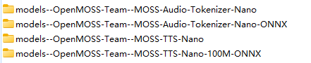

# Hugging Face model download locations

_Exported on 2026/4/22 at GMT+8 13:42:01 from Cursor (3.1.15)_

---

**User**

@app.py 理解一下这个代码，然后告诉我，为啥代码会在 .cache/huggingface/hub目录下，下载图1的模型。在.cache/huggingface/modules/transformers_modules目录下，下载图2的模型。并且在本地的models目录下，下载图3的模型。



---

**Cursor**

正在分析 `app.py` 中 Hugging Face 缓存与本地 `models` 目录的用法。

---------- 我要开始回复了 ----------

下面按「`app.py` 实际做了什么」和「三种目录各自是谁写的」说明。

## `app.py` 在做什么

`app.py` 的入口里只构造 **`NanoTTSService`**，并把**默认的 checkpoint / audio tokenizer 路径**传进去（可被你命令行参数改掉）：

```2874:2881:C:/Caiyifeng/02Codebase/code_opensource/MOSS-TTS-Nano/app.py
    runtime = NanoTTSService(
        checkpoint_path=args.checkpoint_path,
        audio_tokenizer_path=args.audio_tokenizer_path,
        device=resolved_runtime_device,
        dtype=args.dtype,
        attn_implementation=args.attn_implementation,
        output_dir=args.output_dir,
    )
```

这两个默认值在 `moss_tts_nano/defaults.py` 里定义成 **Hugging Face 上的仓库 ID（字符串）**，不是项目里的 `models/...` 本地路径：

```8:11:C:/Caiyifeng/02Codebase/code_opensource/MOSS-TTS-Nano/moss_tts_nano/defaults.py
DEFAULT_CHECKPOINT_PATH = "OpenMOSS-Team/MOSS-TTS-Nano"
DEFAULT_AUDIO_TOKENIZER_PATH = "OpenMOSS-Team/MOSS-Audio-Tokenizer-Nano"
```

真正发起下载的是 `moss_tts_nano_runtime.NanoTTSService` 里的 `transformers` **`from_pretrained(...)`**，并且 **`trust_remote_code=True`**。若路径在磁盘上**不存在**（对 repo ID 会走在线拉取）：

```322:326:C:/Caiyifeng/02Codebase/code_opensource/MOSS-TTS-Nano/moss_tts_nano_runtime.py
            audio_tokenizer = AutoModel.from_pretrained(
                self.audio_tokenizer_path,
                trust_remote_code=True,
                local_files_only=_existing_local_model_path(self.audio_tokenizer_path) is not None,
            )
```

```359:363:C:/Caiyifeng/02Codebase/code_opensource/MOSS-TTS-Nano/moss_tts_nano_runtime.py
        model = AutoModelForCausalLM.from_pretrained(
            self.checkpoint_path,
            trust_remote_code=True,
            local_files_only=_existing_local_model_path(self.checkpoint_path) is not None,
        )
```

---

## 图 1：`.cache/huggingface/hub` 下 `models--组织--仓库名` 这种目录

这是 **Hugging Face Hub 的默认快照缓存**（`HF_HOME` 默认在 `~/.cache/huggingface`）。当 `from_pretrained("OpenMOSS-Team/...")` 需要从网上拉**权重、配置、tokenizer 等**时，`huggingface_hub` 会按它的约定在 **`hub` 下** 建 `models--{org}--{repo_name}` 这种文件夹（你截图里四个里，与 **`app.py` 这条 PyTorch 推理路径直接相关** 的，主要是 **`MOSS-TTS-Nano` 和 `MOSS-Audio-Tokenizer-Nano` 的 PyTorch 仓库**；若你曾用别的方式或别的脚本拉过同组织的 **ONNX 仓库 ID**，也会在同一层缓存里多出一批 `...-ONNX` 目录，逻辑相同，都是「按 repo 缓存快照」）。

---

## 图 2：`.cache/huggingface/modules/transformers_modules` 下如 `OpenMOSS_hyphen_Team` 等

`from_pretrained(..., trust_remote_code=True)` 时，Transformers 会从该 Hub 仓库里拉 **自定义模型代码**（如 `modeling_*.py` 等），并缓存在 **`modules/transformers_modules/`** 下。为了避免路径里出现非法目录名，**仓库名/路径会做成「被转义」的目录名**（例如用 `_hyphen_` 代替 `-` 等），所以你看到的是 **`OpenMOSS_hyphen_Team` 这种名字**，不是随便起的，是 **remote code 缓存的命名规则**。

---

## 图 3：项目里 `models` 下 `MOSS-...-ONNX` 两个文件夹

**这一条不是 `app.py`（PyTorch 版 Web 演示）在下载。** 当前仓库里，把 ONNX 明确下载到**仓库根目录的 `models/`** 下子目录的，是 **`onnx_tts_runtime.py`**：默认目录是 `REPO_ROOT / "models"`，缺省时会对两个 ONNX 仓库做 `snapshot_download(..., local_dir=...)`，直接落到例如 `models/MOSS-TTS-Nano-100M-ONNX` 和 `models/MOSS-Audio-Tokenizer-Nano-ONNX`：

```29:33:C:/Caiyifeng/02Codebase/code_opensource/MOSS-TTS-Nano/onnx_tts_runtime.py
DEFAULT_BROWSER_ONNX_MODEL_DIR = REPO_ROOT / "models"
DEFAULT_BROWSER_ONNX_TTS_DIR = DEFAULT_BROWSER_ONNX_MODEL_DIR / "MOSS-TTS-Nano-100M-ONNX"
DEFAULT_BROWSER_ONNX_CODEC_DIR = DEFAULT_BROWSER_ONNX_MODEL_DIR / "MOSS-Audio-Tokenizer-Nano-ONNX"
DEFAULT_BROWSER_ONNX_TTS_REPO_ID = "OpenMOSS-Team/MOSS-TTS-Nano-100M-ONNX"
DEFAULT_BROWSER_ONNX_CODEC_REPO_ID = "OpenMOSS-Team/MOSS-Audio-Tokenizer-Nano-ONNX"
```

```127:142:C:/Caiyifeng/02Codebase/code_opensource/MOSS-TTS-Nano/onnx_tts_runtime.py
def _download_default_browser_onnx_assets(model_dir: Path) -> None:
    logging.info("browser_onnx assets missing under %s; downloading from Hugging Face.", model_dir)
    ...
    _snapshot_download_repo(
        repo_id=DEFAULT_BROWSER_ONNX_TTS_REPO_ID,
        local_dir=tts_dir,
        allow_patterns=("*.onnx", "*.data", "*.json", "tokenizer.model"),
    )
    _snapshot_download_repo(
        repo_id=DEFAULT_BROWSER_ONNX_CODEC_REPO_ID,
        local_dir=codec_dir,
        allow_patterns=("*.onnx", "*.data", "*.json"),
    )
```

这类逻辑通常由 **`app_onnx.py` / `infer_onnx.py`** 等走 ONNX 运行时的入口在第一次需要资源时触发，而不是 `app.py` 的 `NanoTTSService`。

---

**小结：**

| 位置                       | 原因（与仓库代码的对应关系）                                                                                                                    |
| ------------------------ | --------------------------------------------------------------------------------------------------------------------------------- |
| `hub` 下 `models--...`    | `from_pretrained( Hub repo id )` 等拉 **模型仓快照** 时的默认 Hub 缓存。                                                                        |
| `transformers_modules`   | `trust_remote_code=True` 时拉 **远程 Python 代码** 的专用缓存。                                                                               |
| 项目内 `models/MOSS-*-ONNX` | `onnx_tts_runtime` 里 **`snapshot_download(..., local_dir=项目/models/子目录)`** 显式指定，服务浏览器/CPU ONNX 那条线，**不是 `app.py` 的 PyTorch 主路径。** |

若你只运行过 `app.py`，一般会出现图 1、图 2 中与 **`MOSS-TTS-Nano` / `MOSS-Audio-Tokenizer-Nano`（非 ONNX）** 相关的内容；图 3 的 ONNX 目录多半来自你（或你跑过的 **`app_onnx` / `infer_onnx`**）触发了 `ensure_browser_onnx_model_dir` 那套逻辑。

----- 我回复完成了 -----

---

**User**

那你再看一下 @app_onnx.py 

---

**Cursor**

正在阅读 `app_onnx.py` 的结构与与 ONNX 下载逻辑的关系。

---------- 我要开始回复了 ----------

`app_onnx.py` 不是重写一套 Web 服务，而是 **在 `app.py` 之上换一套「推理后端」**：仍然用同一份 `legacy_app._build_app(...)` 建 FastAPI，但把**运行时、首页 HTML 渲染、请求用的 RuntimeManager 类**换成 ONNX/ORT 版本。

## 1. 和 `app.py` 的关系

- 第 17 行：`import app as legacy_app`，后面复用 `legacy_app` 里的大量逻辑（路由、`WarmupManager`、`_build_app` 等）。
- 在 `main()` 里**替换**两个全局钩子：
  - `legacy_app.RequestRuntimeManager = OnnxRequestRuntimeManager`
  - `legacy_app._render_index_html = _render_index_html_onnx`
- 用 `uvicorn` 跑的还是 `legacy_app._build_app(...)` 返回的 `app`，只是 `runtime` 传进去的是 `OnnxNanoTTSServiceAdapter` 而不是 `NanoTTSService`。

所以：**界面和 API 结构跟 PyTorch 版 `app.py` 对齐，底层从 Torch 变成 ONNX Runtime（CPU）**。

## 2. `OnnxNanoTTSServiceAdapter` 在做什么

它是对 **`OnnxTtsRuntime`** 的薄封装，用来在接口上**模仿** `app.py` 里 `NanoTTSService` 会用到的方法（例如 `get_model` / `warmup` / `synthesize` / 流式合成等），这样 `app.py` 里既有代码不用大改就能驱动 ONNX。

构造时关键一行：

```53:57:c:/Caiyifeng/02Codebase/code_opensource/MOSS-TTS-Nano/app_onnx.py
        self.runtime = OnnxTtsRuntime(
            model_dir=model_dir,
            thread_count=max(1, int(cpu_threads)),
            max_new_frames=int(max_new_frames),
            output_dir=self.output_dir,
        )
```

而 `OnnxTtsRuntime.__init__` 里第一件事就是：

```292:292:c:/Caiyifeng/02Codebase/code_opensource/MOSS-TTS-Nano/onnx_tts_runtime.py
        resolved_model_dir = ensure_browser_onnx_model_dir(model_dir)
```

也就是说：**只要你启动 `app_onnx.py` 并第一次需要模型，就会走** `ensure_browser_onnx_model_dir` → 缺资源时在仓库 **`models/`** 下用 `snapshot_download` 拉 **两个 ONNX 仓库**（你之前图 3 的那两个子目录就是这里写的）。

`--model-dir` 可覆盖默认根目录；**省略时** help 里写得很清楚，用的是 `DEFAULT_BROWSER_ONNX_MODEL_DIR`（项目下的 `models`）并 **首次自动下载**：

```576:584:c:/Caiyifeng/02Codebase/code_opensource/MOSS-TTS-Nano/app_onnx.py
    parser.add_argument(
        "--model-dir",
        default=None,
        help=(
            "browser_onnx model directory. If omitted, the app uses "
            f"{DEFAULT_BROWSER_ONNX_MODEL_DIR} and auto-downloads the ONNX assets on first run."
        ),
    )
```

## 3. 和「`.cache` 里那两类」的关系

- **`app_onnx.py` 这条路径不调用 `transformers` 的 `from_pretrained`，也不设 `trust_remote_code`**，因此 **仅凭 ONNX 演示本身**，不会为你上一问里那套 **PyTorch 模型** 去写 **`transformers_modules`**。
- 它主要触发的，是你已经看到的：**把 ONNX 配齐到 `项目/models/...`（`local_dir`）** 的那条逻辑。Hub 的 `hub/models--...` 里是否还会出现 ONNX 相关快照，还取决于你本机 `huggingface_hub` 版本是否顺带用缓存/别的命令拉过同名仓库，但**代码里明确落盘的位置是 `models` 下子目录**。

## 4. 页面上和 PyTorch 版的差异

`_render_index_html_onnx` 在继承 `app.py` 渲染结果的基础上，把标题改成 “ONNX Demo”，把「Attention」下拉改成 **Sampling Mode（fixed/full/greedy）**，并注入一段 **同步 Do Sample 与各温度/Top‑P 等控件** 的脚本——因为 ONNX 版采样行为与 `sdpa`/`eager` 那套不同。

---

**一句话**：`app_onnx.py` = **同一份 Web 壳 + ONNX Runtime 后端**；**本地下载到 `models/MOSS-…-ONNX` 的动机**就在 **`OnnxTtsRuntime` → `ensure_browser_onnx_model_dir`**，由 `app_onnx` 的 `model_dir`（默认 `None` → 用项目 `models/`）传进去触发。

----- 我回复完成了 -----

---

**User**

也就是现在 .cache/huggingface/ 目录下面的nano模型，是app.py 下载的。models/ 目录下的 ONNX 模型是 app_onnx.py 下载的。但 .cache/huggingface/ 目录下面的 ONNX 模型，还不知道谁下载的？

---

**Cursor**

正在搜索代码库中是否还有其它会拉取 ONNX 仓库到默认 Hub 缓存的路径。

---------- 我要开始回复了 ----------

可以这么归纳你的三句话，再补上 **`.cache/huggingface/hub` 里 ONNX 那一层** 怎么理解。

## 1. 你对 `app.py` 和 `app_onnx.py` 的划分

- **PyTorch 的 Nano 仓库**（`OpenMOSS-Team/MOSS-TTS-Nano`、`…/MOSS-Audio-Tokenizer-Nano`）主要是跑 **`app.py`（`NanoTTSService` + `from_pretrained`）** 时拉进默认 Hub 缓存的；另外 **`transformers` 的 `trust_remote_code`** 会在 **`modules/transformers_modules`** 下缓存代码（这点你之前已理清）。
- **`models/MOSS-…-ONNX`** 是 **`onnx_tts_runtime` 里 `ensure_browser_onnx_model_dir` → `snapshot_download(…, local_dir=项目/models/…子目录)`** 写的，通常由 **`app_onnx.py`、`infer_onnx.py`、或带 `--backend onnx` 的 CLI** 第一次需要模型时触发。

## 2. `.cache/huggingface/hub` 里那些 **ONNX** 名字是谁下的？

**在本仓库里，没有任何一条路径是「单独只为填满 Hub 里的 ONNX 而写的」。** 和 ONNX 相关的下载入口都集中在 **`onnx_tts_runtime._download_default_browser_onnx_assets` → `snapshot_download`，且 `local_dir` 指向的是仓库里的 `models/...`**（不是 Hub 的“默认 cache 根目录”那种用法）。

但 **`huggingface_hub` 在不同版本下行为不完全一样**：有的实现会尽量把文件**直接**落到你给的 `local_dir`；是否还会同时在 **`$HF_HOME`（常见即 `~/.cache/huggingface`）下的 `hub/models--...`** 里出现一份/硬链接/复用，取决于 **库版本、是否走 blob 缓存、以及当时有没有用别的 API**。因此：

- **很常见的一种情况**：你跑过 **`app_onnx` / `infer_onnx` / ONNX CLI** 之后，**既**在 **`models/`** 里看到 ONNX，**也**在 **`.cache/.../hub`** 里看到同名的 `models--OpenMOSS-Team--...-ONNX`——**有可能就是同一次 `snapshot_download` 在底层和全局缓存的交互**（可以当作「同一套 ONNX 自动下载」带来的，而不是又有一个隐藏脚本）。
- **若你非常确定**当前用的 **`huggingface_hub` 在只传 `local_dir` 时从不在全局 `hub` 里建 `models--...`**，那 Hub 里那层 ONNX 目录**就更像是别的原因**造成的，例如：
  - 曾用过 **`huggingface-cli download OpenMOSS-Team/...-ONNX`**（默认会进 **Hub 缓存**）；
  - 其它项目、IDE 插件、或脚本里对同一 repo 调用了 **`hf_hub_download` / 不带 `local_dir` 的 `snapshot_download`**；
  - 用 **`git lfs` clone** 到别处不会生成这种 `models--` 名，但 **CLI / 某次试验** 会。

所以：**不必理解为「多出一个神秘 `app_xxx`」**；在多数环境下，**Hub 里的 ONNX 与 `models/` 里的 ONNX 同源、同一批下载逻辑**，只是**是否同时在全局 `hub` 留副本**要对照你本机 **`huggingface_hub` 版本**和当时是否还用过 **CLI/别的工具**。

若你想**一条命令钉死**是谁写的，可以在本机看 ONNX 的 hub 目录里 `refs` / 元数据与 **`models/...-ONNX/.huggingface`（若有）** 的时间戳、以及终端历史里是否出现过 `huggingface-cli download`；**本仓库里能搜到的和 ONNX 相关的 Hub 拉取，只有 `onnx_tts_runtime` 里那段对两个 `-ONNX` 仓库的 `snapshot_download`。**

----- 我回复完成了 -----

---

**User**

drwxr-xr-x 3 root root 4096  4月 21 18:23 /home/nvidia/.cache/huggingface/hub/models--OpenMOSS-Team--MOSS-Audio-Tokenizer-Nano-ONNX
drwxr-xr-x 3 root root 4096  4月 21 18:21 /home/nvidia/.cache/huggingface/hub/models--OpenMOSS-Team--MOSS-TTS-Nano-100M-ONNX
nvidia@nvidia-desktop:~/moss_docker$ ls -al model_data/
总计 16
drwxr-xr-x 4 root   root   4096  4月 22 11:39 .
drwxrwxr-x 3 nvidia nvidia 4096  4月 22 11:35 ..
drwxr-xr-x 3 root   root   4096  4月 21 18:23 MOSS-Audio-Tokenizer-Nano-ONNX
drwxr-xr-x 3 root   root   4096  4月 21 18:23 MOSS-TTS-Nano-100M-ONNX

---

**Cursor**

---------- 我要开始回复了 ----------

你贴出来的信息，和前面说的 **ONNX 下载逻辑** 是对得上的，可以这样理解。

## 两处目录分别是什么

1. **`/home/nvidia/.cache/huggingface/hub/models--OpenMOSS-Team--...-ONNX`**  
   这是 **Hugging Face Hub 的默认「全局快照缓存」** 命名方式（`models--组织--仓库名`）。`huggingface_hub` 在拉 `OpenMOSS-Team/...-ONNX` 这类 **repo** 时，**经常会在这里落一份/复用**（和是否再拷到 `local_dir` 可以并存，具体细节随 `huggingface_hub` 版本略有差异，但**在 hub 下看到 ONNX 仓库名是正常现象**）。

2. **`~/moss_docker/model_data/MOSS-...-ONNX`**  
   这是 **`snapshot_download(..., local_dir=你指定的目录)` 显式写出的那份**。在你这份工程里，对应的就是 `onnx_tts_runtime` 里把 TTS/Codec 下到你配置的 **根目录** 下的子目录里；你这里用 **`moss_docker/model_data/`** 而不是仓库里的 `models/`，通常是因为 **Docker/启动参数里把 `--model-dir`（或等价环境变量/挂载点）设成了 `model_data`**，所以和 README 里默认的 `项目/models` 路径不同，但**机制是同一类**。

所以：**不是「两拨完全不同的程序各下各的」**；更合理的解释是 **同一次（或同一条 ONNX 自动下载链）在「全局 Hub 缓存 + 你指定的 `local_dir`」上各留了一份副本**。

## 时间戳

- `hub` 里两个目录：**4 月 21 日 18:21、18:23**  
- `model_data` 下两个子目录：**4 月 21 日 18:23**  

时间挨得很近，和 **先拉一个 repo 再拉另一个、或先写缓存再落 `local_dir`** 很像，**也支持「同一轮 ONNX 拉取」的判断**（`model_data` 的「总计」一行是 4 月 22 日 11:39 多半是**后来父目录有 touch/改权限**等，不矛盾）。

## 为什么全是 `root root`

- **`huggingface` 的缓存**和 **`model_data` 下 ONNX 子目录**都是 `root root`，很像是 **用 root 跑的进程** 建的（**Docker 里默认 root 容器** 最常见）。  
- 这样会出现：**同一路径在容器里被写成 root 属主**；你在外面 `ls` 时就会看到 `root root`。

如果你希望避免 root 写进家目录缓存，一般需要：**容器用非 root 用户**、或设 **`HF_HOME` / 专用缓存目录** 并挂卷，这属于部署习惯问题，不和你贴的「为什么有两处 ONNX」冲突。

**结论**：`hub` 里的 `models--*--*ONNX` 和 `moss_docker/model_data` 里的两个 ONNX 文件夹，**很大概率是同一套 ONNX 自动下载**（`snapshot_download` + `local_dir`）带来的 **「全局 Hub 缓存 + 你指定的 `model_data`」** 双份；**不是** `app.py` 那种 PyTorch `from_pretrained` 拉的。

----- 我回复完成了 -----
