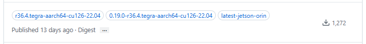

这是一份为您整理的完整笔记，建议您可以将其保存到本地的 Markdown 软件（如 Obsidian、Typora）或技术博客中，方便未来在 Jetson Orin 上部署其他 AI 项目时随时查阅。

---

# 📝 笔记：Jetson Orin 上的 vLLM 部署与 NVIDIA 官方镜像生态深度解析

## 第一部分：vLLM 容器启动命令及参数详解

在 Jetson Orin 上通过 Docker 启动 vLLM 大语言模型（如 Qwen3.5）时，一条完整的命令通常包含 **Docker 容器配置**和 **vLLM 内部启动参数**两部分。

### 1. 完整执行命令（多行排版，方便复制）

```bash
sudo docker run \
  --name=upbeat_panini \
  --hostname=nvidia-desktop \
  --volume /home/nvidia/.cache/modelscope:/root/.cache/modelscope \
  --volume /home/nvidia/.cache/huggingface:/root/.cache/huggingface \
  --network=host \
  --workdir=/ \
  --runtime=nvidia \
  -t \
  ghcr.io/nvidia-ai-iot/vllm:latest-jetson-orin \
  sh -c 'vllm serve /root/.cache/modelscope/hub/models/cyankiwi/Qwen3___5-4B-AWQ-4bit \
    --gpu-memory-utilization 0.55 \
    --max-model-len 4096 \
    --max-num-seqs 2 \
    --enable-prefix-caching \
    --port 8081 \
    --reasoning-parser qwen3 \
    --enable-auto-tool-choice \
    --tool-call-parser qwen3_coder \
    --trust-remote-code'
```

### 2. 参数逐行解读

**🔹 容器基础配置层 (Docker 引擎参数)**

* `--name=upbeat_panini`：为容器指定一个容易记住的名字，方便后续用 `docker stop` 或 `rm` 管理。
* `--volume ...`：目录映射（挂载）。将宿主机上下载好的 ModelScope/HuggingFace 模型缓存目录映射到容器内，避免每次重启容器都要重新下载几十 GB 的模型。
* `--network=host`：共享主机网络。容器内开放的端口（如 8081）直接等同于主机的端口。
* `--runtime=nvidia`：**核心参数**。指定 NVIDIA 运行时，让容器能够调用底层的 GPU 算力。
* `ghcr.io/nvidia-ai-iot/vllm:latest-jetson-orin`：指定使用的官方预编译镜像。

**🔹 大模型运行层 (vLLM 引擎参数)**

* `vllm serve <模型路径>`：启动 vLLM API 服务，并加载指定的本地模型文件。
* `--gpu-memory-utilization 0.55`：**边缘设备防死机关键**。限制模型最多只能占用 55% 的可用 GPU 显存，留出空间给系统或其他任务（如语音合成 MOSS-TTS）。
* `--max-model-len 4096`：限制最大上下文长度为 4096 Tokens，以控制显存消耗。
* `--max-num-seqs 2`：最大并发处理数设为 2，防止多人同时请求导致显存溢出（OOM）。
* `--enable-prefix-caching`：开启前缀缓存。对相同的系统提示词进行缓存，大幅提升二次请求的响应速度。
* `--port 8081`：指定 vLLM 服务的监听端口。
* `--reasoning-parser / --tool-call-parser`：指定专门的解析器，用于优化模型的推理链（CoT）和外部工具调用（Tool Calling）能力。
* `--trust-remote-code`：允许执行模型包中自带的自定义 Python 架构代码（运行较新模型必备）。

---

## 第二部分：探秘 NVIDIA 官方镜像生态库

在上面的命令中，我们使用了 `ghcr.io/.../vllm` 镜像。这个镜像并不在常用的 Docker Hub 上，而是来自 GitHub Container Registry。

### 1. 去哪里找这些预编译好的 AI 镜像？

NVIDIA 边缘 AI 团队（NVIDIA-AI-IOT）专门为 Jetson 玩家打造了一个“镜像应用商店”。在这个页面里，你可以找到几百个为 ARM 架构和 Jetson 硬件量身定制的 AI 工具：
👉 **Jetson 专属镜像商店**：[https://github.com/orgs/NVIDIA-AI-IOT/packages](https://github.com/orgs/NVIDIA-AI-IOT/packages)

这里面包含了市面上最火的 AI 框架，如：

* **大模型推理**：`vllm`, `ollama`, `llama_cpp`
* **多模态视觉**：`live-vlm-webui`
* **底层框架**：`transformers`, `mlc`

### 2. 如何看懂硬核的“版本标签 (Tag)”？

点进任意一个镜像（如 vllm），你会发现有很多不同的标签。除了好记的 `latest-jetson-orin`，还会看到类似 `r36.4.tegra-aarch64-cu126-22.04` 的硬核标签。它的含义是：

* **`r36.4`**：对应底层的 JetPack 6.0/6.1 系统 (L4T 36.4)。
* **`tegra-aarch64`**：代表 ARM 架构的 Tegra 芯片。
* **`cu126`**：镜像内置了 CUDA 12.6 驱动。
* **`22.04`**：底层系统是基于 Ubuntu 22.04。

**避坑指南**：如果你未来升级了板子的 JetPack 系统，记得来这里挑选对应底层版本号（比如选 `r35.x` 对应 JetPack 5）的镜像，切忌无脑使用 latest。

**图示：**



---

## 第三部分：Docker 镜像使用哲学与组合指南

很多初学者会有一个误区：**“既然大家都是 AI 模型，我能不能把所有的东西（比如 LLM 和 TTS）都装进一个现成的镜像（比如 Ollama）里？”**

### 1. 基础镜像 vs 应用镜像

* **毛坯房（如 `ubuntu:22.04`）**：什么都没有。适用于像 MOSS-TTS 这样没有官方预编译镜像的小众项目。你需要自己写 `Dockerfile`，配置 Python 和各种音频依赖。
* **精装房（如 `vllm` / `ollama` 镜像）**：拿来即用。里面预装了所有必需的 C++ 和 CUDA 库，但**高度偏科**。比如 Ollama 底层（llama.cpp）只认识文本，根本没有处理声音波形的能力。

### 2. 核心原则：一个容器只做一件事（微服务架构）

**强烈不推荐**将 MOSS-TTS 强行安装到 vLLM 或 Ollama 镜像中，原因如下：

1. **依赖冲突**：文本模型和语音合成模型需要的底层 C++ 库（如 `libsndfile`）和 Python 库版本往往互相冲突。
2. **显存抢占**：放在同一个容器中极易引发显存抢占，导致 `CUDA Out of Memory`。

### 3. 终极部署方案：组合微服务

打造一个完整的 Jetson AI 语音助手的最佳实践是让它们在各自的容器里独立运行，通过网络互联：

1. **大脑容器（直接拉取预编译）**：使用 NVIDIA 提供的 `ollama` 或 `vllm` 镜像，运行在 `8081` 端口，专门负责极速文本生成。
2. **嘴巴容器（手工编写构建）**：使用基于 Ubuntu 的 `Dockerfile`，配置特定版本的 PyTorch 和环境，运行 MOSS-TTS-Nano 于 `18083` 端口，专门处理语音转换。
3. **联动**：通过一个简单的 Python 脚本，让两者通过 `127.0.0.1` 的端口进行内部通信，互不干扰，完美发挥 Jetson Orin 的并发算力。